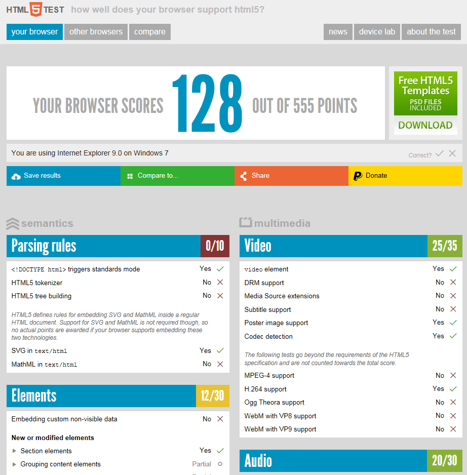
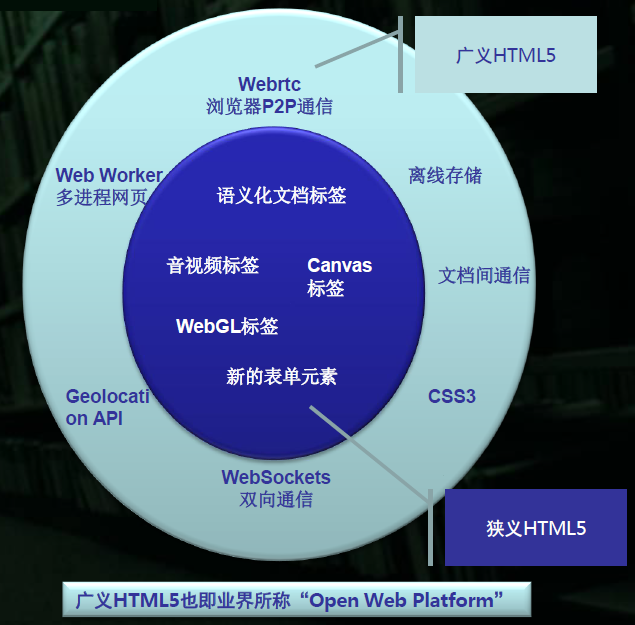
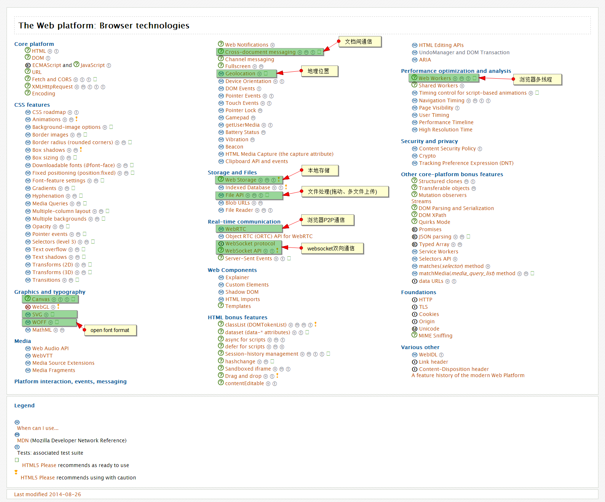

####HTML 5

预研HTML 5中的每个技术，在这里形成可产品化的JS库
====================================================
######HTML 5浏览器支持情况
+ 了解浏览器支持最新情况, [详见该链接](http://caniuse.com/)
+ 浏览器支持情况2, [详见该链接](http://html5test.com/index.html)
  
+ 使用[modernizr](http://modernizr.com)解决兼容性问题
+ [W3C成员Mike Smith编著了一个全方位介绍web平台和浏览器技术的综合列表](http://platform.html5.org/)
+ [本地不支持HTML5时，可以采用的扩展库:HTML5-Cross-Browser-Polyfills](https://github.com/Modernizr/Modernizr/wiki/HTML5-Cross-Browser-Polyfills)
+ HTML5 定义
  

######[HTML 5预研的范围](http://platform.html5.org/)

######HTML 5标签

######HTML 5 本地存储

######HTML 5 websocket双向通信